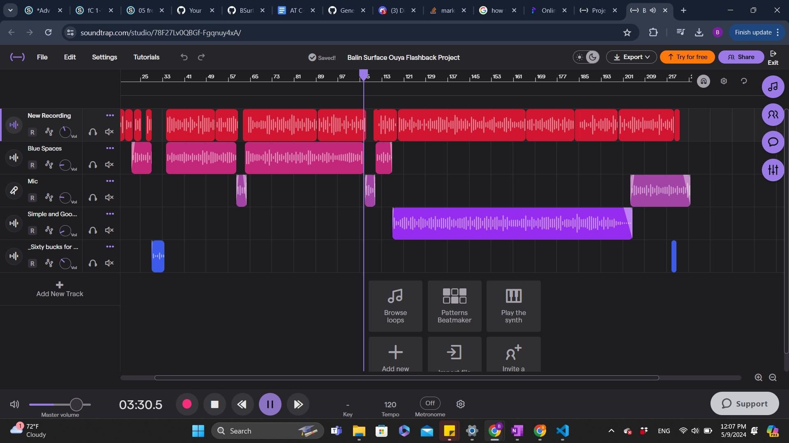

## Flashback and Ethical Hacking Podcasts 

### Description
> Both of these podcasts were extremely fun to make, from the initial research process to recording and editing the podcast itself. Firstly, for the ethical hacking podcast, I wanted to delve into the real-world applications of a deep understanding of how software works, and how data is transferred. The history aspect of ethical hacking was extremely interesting as well, and it is amazing to think that a small whistle can lead to a huge industry involving white-hat hacking and personal and government data. Next, for the Ouya project, I felt that it ventured in a different direction furthering my understanding of early mobile software, such as Android's Jelly Bean.
### Technologies or Tools Used
> I created a list of sources referenced for each podcast, and for my ethical hacking podcast, I created a simple website to showcase the audio and transcript using HTML and CSS through Github. For my flashback podcast, I used Soundtrap to edit and lay music over my script.
### Screenshots or Code

### Link or Code
#### Ethical Hacking Podcast Website:
https://balin-surface--splendorous-kashata-83d12f.netlify.app/

#### Ethical Hacking Podcast index.html
https://github.com/BSurface/bsurface/blob/2d86550051002f363449d1b54467955e93af1080/index.html

#### Ethical Hacking Podcast style.css
https://github.com/BSurface/bsurface/blob/2d86550051002f363449d1b54467955e93af1080/index.css

#### Ouya Flashback Podcast:
https://github.com/BSurface/ap-csa-final-project-portfolio/assets/123583892/8335cdad-66ac-4694-8d8e-5f9be341aee9

